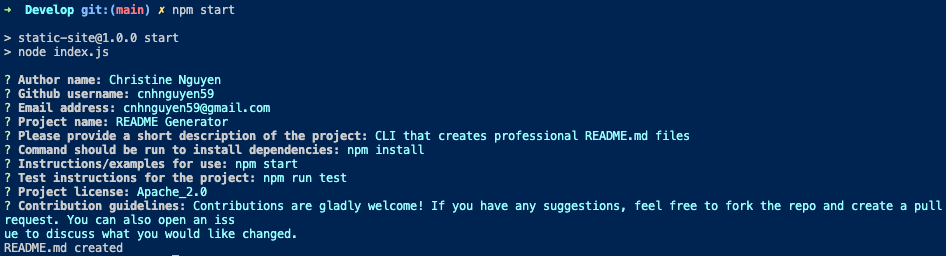

# README Generator

  
  
  ## Description
  
  CLI that creates professional README.md files

  - [Installation](#install)
  - [Usage](#usage)
  - [Test](#test)
  - [Contribution Guidelines](#contribute)
  - [Questions](#questions)
  - [License](#license)
  
  <a name="install"></a>
  ## Installation
  
  Use the packet manager npm install to install README Generator
  ```bash 
  npm install
  ```
  
  <a name="usage"></a>
  ## Usage
  
  ```bash 
  npm start
  ```
  

  
  
  Video Link: https://watch.screencastify.com/v/lBXZgWDPf66y3EOJXxZJ
  
  <a name="test"></a>
  ## Test
  
  ```bash 
  npm run test
  ```

  <a name="contribute"></a>
  ## Contribution Guidelines

  Contributions are gladly welcome! If you have any suggestions, feel free to fork the repo and create a pull request. You can also open an issue to discuss what you would like changed.
  
  <a name="questions"></a>
  ## Questions
  
  Github: cnhnguyen59 (https://github.com/cnhnguyen59)
  Email: cnhnguyen59@gmail.com
  ________
  <a name="license"></a>
  ## License
  

  Copyright © 2022 Christine Nguyen
  This project is Apache_2.0 licensed.
  